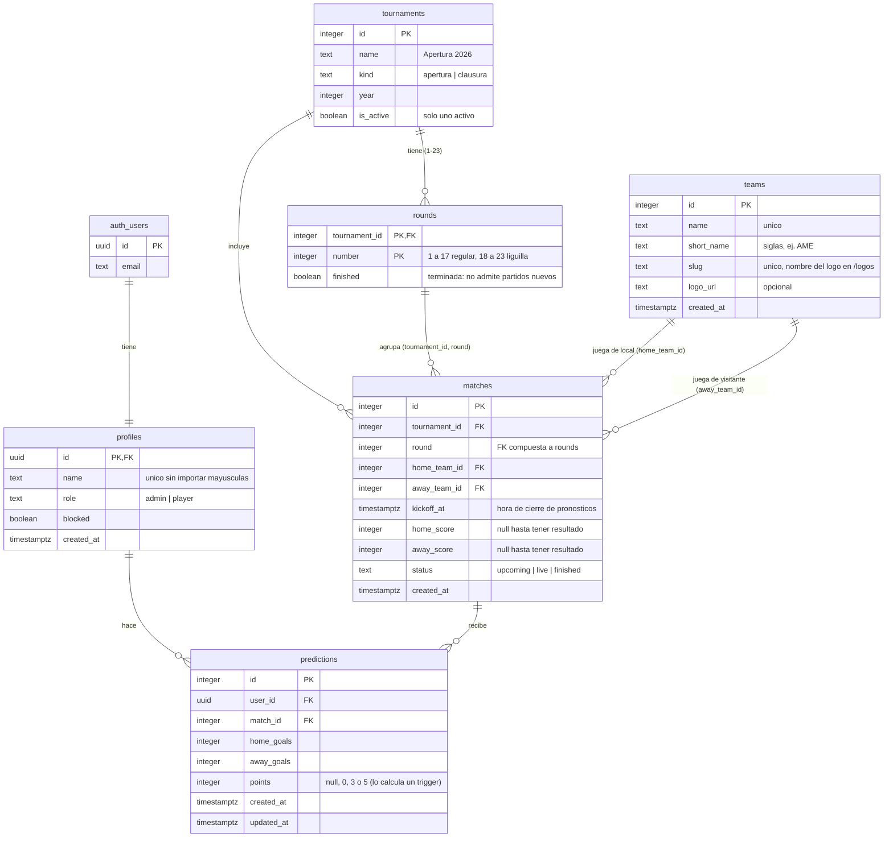

# UML de la base de datos

Diagrama entidad-relación (Mermaid) del esquema en Supabase Postgres.
`teams` ya está aplicada (migración `20261005000400_teams_table.sql`): los partidos referencian equipos por `id`, ya no por texto.

## Reglas del modelo

- `matches.home_team_id` y `matches.away_team_id` son FK a `teams.id`, con `check (home_team_id <> away_team_id)`.
- `teams` la modifica solo el desarrollador (RLS: lectura para usuarios activos, sin escritura desde la app). Reemplazó al dominio `team_name`; `frontend/src/lib/equipos.ts` solo conserva colores y siglas del escudo por defecto.
- `predictions` es única por `(user_id, match_id)`; si se borra el partido se borran sus pronósticos.
- Los colores y siglas del escudo por defecto pueden quedarse en el front o pasar a `teams` más adelante.
- Cada torneo (Apertura/Clausura) tiene sus propias jornadas; `rounds` se crea sola (1-23) al crear el torneo. Las posiciones se calculan por torneo.
- Una jornada con `finished = true` no admite partidos nuevos ni mover partidos hacia ella (trigger `reject_finished_round`).
- Las fechas de una jornada ("12 – 15 oct") no se guardan: se calculan con la primera y la última hora de sus partidos.
- Liguilla (8 equipos, sin Play-In): `round` 18 y 19 = Cuartos ida/vuelta, 20 y 21 = Semifinal ida/vuelta, 22 y 23 = Final ida/vuelta. Cada partido de ida y de vuelta se pronostica y puntúa por separado. Los nombres se calculan en `frontend/src/lib/jornadas.ts`.
